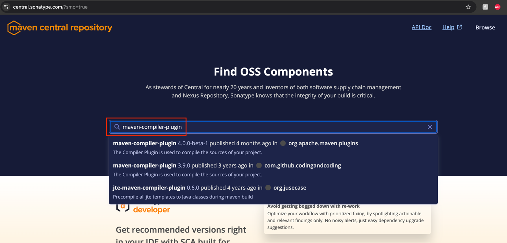
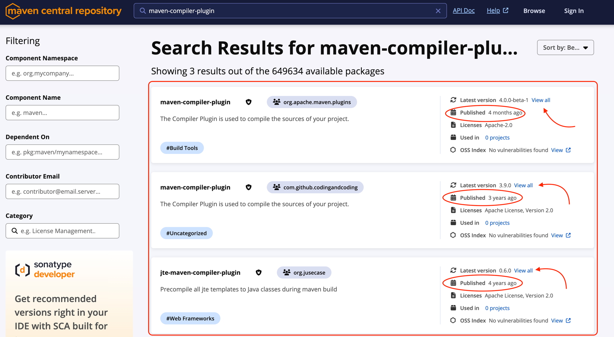
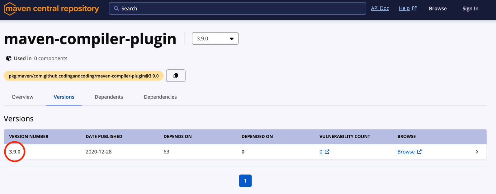

# Configuring Maven In pom.xml

You can visit the [Central Maven Repository](https://central.sonatype.com/search?q=maven-compiler-plugin) and search for
maven-compiler-plugin to view all versions available.





When setting this in the pom.xml you can provide the following properties as a variable:

```
<properties>
  <maven.compiler.version>3.9.0</maven.compiler.version>
</properties>
```

Add the additional configuration to the pom.xml file:

```
<build>
  <plugins>
     <plugin>
         <groupId>org.apache.maven.plugins</groupId>
         <artifactId>maven-compiler-plugin</artifactId>
         <version>${maven.compiler.version}</version> 
         <configuration>
            <encoding>UTF-8</encoding>
            <source>${java.version}</source>
            <target>${java.version}</target>
         </configuration>
     </plugin>
  </plugins>
</build>
```